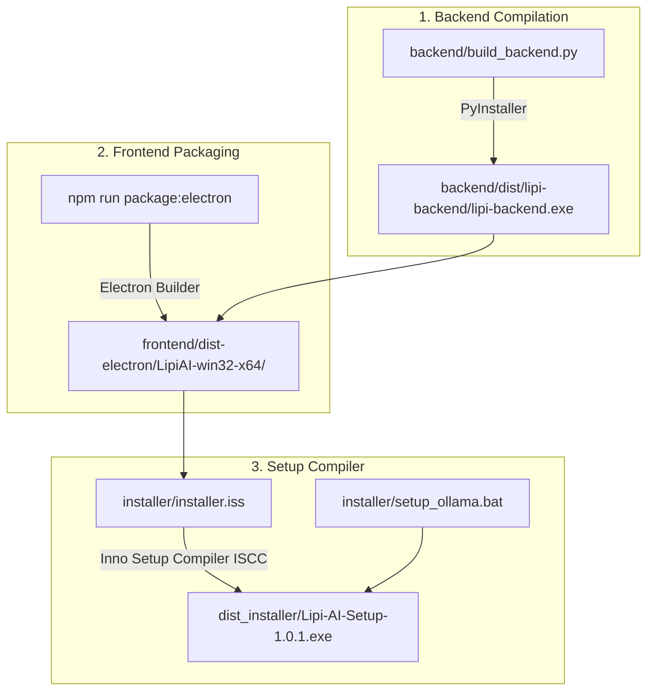

# 📦 Lipi AI — Windows Installer & Packaging Guide

This guide details how the **Lipi AI** Windows installer (`Lipi-AI-Setup-1.0.1.exe`) is built, how it handles automated dependency bootstrap (Ollama & AI models), and how to compile new distributable builds.

---

## 🛠️ Build Pipeline Overview

The Lipi AI distribution pipeline packages a **Python FastAPI backend** and a **React 19 / Electron frontend** into a unified Windows Installer (`.exe`).



---

## 📋 Build Prerequisites

To compile the installer on a Windows machine, ensure you have:

1. **Python 3.10+**: With virtual environment set up in `backend/venv`.
2. **Node.js 18+ & npm**: For building React and Electron assets.
3. **Inno Setup 6**: Used to generate the installer wizard `.exe`.
   - Install via Winget:
     ```cmd
     winget install JRSoftware.InnoSetup
     ```
   - Or download manually from [Inno Setup official website](https://jrsoftware.org/isdl.php).

---

## 🚀 How to Build a New Installer (1-Click)

From the project root directory, run:

```cmd
build_dist.bat
```

### What `build_dist.bat` does under the hood:

1. **Builds Backend Executable**:
   - Uses PyInstaller (`backend/build_backend.py`) to create a self-contained Python backend bundle at `backend/dist/lipi-backend/`.
2. **Builds Electron App**:
   - Compiles Vite production React assets (`npm run build`).
   - Copies the PyInstaller backend files into Electron's app resources.
   - Runs `electron-packager` to produce `frontend/dist-electron/LipiAI-win32-x64/`.
3. **Compiles Installer**:
   - Invokes Inno Setup (`ISCC.exe`) on `installer/installer.iss`.
   - Produces the output binary at:
     ```text
     dist_installer/Lipi-AI-Setup-1.0.1.exe
     ```

---

## ✨ Features Built into the Windows Installer

The `Lipi-AI-Setup-1.0.1.exe` wizard includes the following built-in automation:

### 1. Automated Ollama & Model Bootstrapper (`setup_ollama.bat`)
When the user finishes running the installer, a post-install configuration step checks for Ollama:
- **Ollama Detection**: Checks `where ollama` and `%LOCALAPPDATA%\Programs\Ollama`.
- **Automatic Download**: If Ollama is not installed, it silently downloads `OllamaSetup.exe` directly from `https://ollama.com` via PowerShell and launches the setup.
- **Service Verification**: Ensures the Ollama background service (`http://127.0.0.1:11434`) is running.
- **Model Pulling**: Automatically runs `ollama pull gemma2:2b` and `ollama pull nomic-embed-text` so the local AI engine is ready on first launch.

### 2. Custom Installation Directory
Users can choose where to install Lipi AI (defaults to `%ProgramFiles%\Lipi AI`).

### 3. Explorer Context Menu Integration
- Registers `"Open with Lipi AI"` in the Windows right-click context menu for all `.pdf` files.
- Automatically handles file association launch parameters.

### 4. Desktop & Start Menu Shortcuts
Creates Start Menu entries and an optional Desktop icon.

---

## 📁 Key Installer Component Files

```
Lipi-AI/
├── build_dist.bat               # Master 1-click build script
├── dist_installer/              # Output directory for compiled Setup.exe
│   └── Lipi-AI-Setup-1.0.1.exe  # Final Windows Setup Wizard
├── installer/
│   ├── installer.iss            # Inno Setup compilation specification
│   └── setup_ollama.bat         # Post-install script for Ollama & AI model bootstrap
└── backend/
    └── build_backend.py         # PyInstaller backend packaging script
```

---

## 🔧 Updating Version Numbers for New Releases

When preparing a new release (e.g. `v1.0.2`):

1. **Update `installer/installer.iss`**:
   ```iss
   #define MyAppVersion "1.0.2"
   ```
2. **Update `frontend/package.json`**:
   ```json
   "version": "1.0.2"
   ```
3. **Update `backend/app/main.py`**:
   ```python
   version="1.0.2"
   ```
4. Run `build_dist.bat` to generate `dist_installer/Lipi-AI-Setup-1.0.2.exe`.

---

## ❓ Frequently Asked Questions & Troubleshooting

### Q: Why does Windows SmartScreen or Antivirus flag the setup file?
PyInstaller and Inno Setup binaries created on local developer machines are not signed with a paid EV Code Signing Certificate. If Windows Defender SmartScreen shows a prompt:
- Click **"More info"** → **"Run anyway"**.

### Q: What if Ollama fails to download during installation?
Users can manually download Ollama from [https://ollama.com](https://ollama.com) and run:
```cmd
ollama pull gemma2:2b
ollama pull nomic-embed-text
```
Lipi AI will automatically detect Ollama when launched.

### Q: Can I run Lipi AI without local Ollama?
Yes! Lipi AI supports **Cloud Mode via Google Gemini**. Users can switch to Gemini mode in the settings and provide a Gemini API key without installing local Ollama models.
