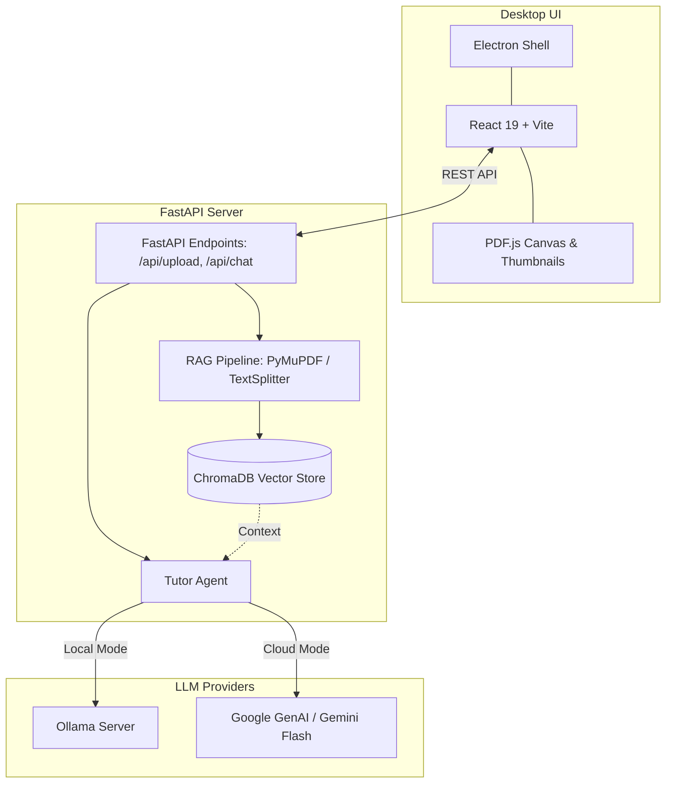

# 📚 Lipi AI — Smart Document & Study Assistant

[](https://fastapi.tiangolo.com)
[](https://react.dev)
[](https://www.electronjs.org/)
[](https://www.langchain.com/)
[](https://www.trychroma.com/)
[](https://ollama.com/)

**Lipi AI** is a desktop application designed for contextual, hallucination-free document interaction and study assistance. Powered by **Retrieval-Augmented Generation (RAG)**, it enables you to upload PDF documents, browse them through an integrated viewer, and ask questions with high precision using either offline local LLMs via **Ollama** or cloud intelligence via **Google Gemini**.

---

## ✨ Features

- 📑 **Integrated PDF Workspace**: Side-by-side interactive document canvas with thumbnail navigation, zoom controls, and active page jump.
- 🔒 **Dual AI Execution Modes**:
  - **Local (Offline)**: 100% private, local document processing powered by Ollama (`gemma2:2b` + `nomic-embed-text`).
  - **Cloud (Gemini)**: Fast, high-reasoning intelligence with Google AI Studio (`gemini-3.6-flash`).
- ⚡ **Memory-Safe Micro-Batched Ingestion**: 10-chunk micro-batches with automatic exponential backoff retry and single-chunk fallback to handle large documents without VRAM/memory crashes.
- 🛡️ **Mode-Isolated & Self-Healing Vector Store**: Independent ChromaDB persistence paths (`ollama/` vs `gemini/`) with automatic dimension verification and silent auto-reindexing on model changes.
- 🎯 **Strict Document Grounding**: Guardrail prompts ensure answers are directly retrieved from the document context without hallucinations.
- 📐 **Rich Math & Code Support**: Full markdown rendering with **LaTeX** math equations via KaTeX and syntax-highlighted code blocks.

---

## 🏗️ Architecture



---

## 📋 Prerequisites

Ensure you have the following installed on your machine:

1. **Python**: Version 3.10+ ([Download Python](https://www.python.org/downloads/))
2. **Node.js**: Version 18+ & npm ([Download Node.js](https://nodejs.org/))
3. **Ollama** *(Optional for local mode)*: ([Download Ollama](https://ollama.com/))
   - Pull the recommended models:
     ```bash
     ollama pull gemma2:2b
     ollama pull nomic-embed-text
     ```

---

## 🚀 Quickstart & Installation

### 1. Clone the Repository
```bash
git clone https://github.com/VAbhijith2003github/Lipi-AI.git
cd Lipi-AI
```

### 2. Backend Setup
```bash
cd backend
python -m venv venv

# Windows:
venv\Scripts\activate

# macOS / Linux:
# source venv/bin/activate

pip install -r requirements.txt
```

### 3. Frontend Setup
```bash
cd ../frontend
npm install
```

### 4. Environment Configuration
Copy `.env.example` to `.env` in either the root or `backend/` directory:
```bash
cp .env.example .env
```
Configure your settings:
```env
# Optional: Required only if using Google Gemini mode
GEMINI_API_KEY=your_gemini_api_key_here

# Ollama local settings (defaults)
OLLAMA_BASE_URL=http://127.0.0.1:11434
OLLAMA_CHAT_MODEL=gemma2:2b
OLLAMA_EMBED_MODEL=nomic-embed-text
```

---

## 🏃 Running the Application

### Option A: One-Click Launcher (Windows)
Double-click `start_app.bat` or execute in terminal:
```cmd
start_app.bat
```

### Option B: Manual Execution

1. **Start FastAPI Backend**:
   ```bash
   cd backend
   venv\Scripts\activate
   python -m uvicorn app.main:app --reload --port 8000
   ```

2. **Start Electron App**:
   ```bash
   cd frontend
   npm run dev
   ```

---

## 📁 Repository Structure

```
Lipi-AI/
├── backend/
│   ├── app/
│   │   ├── agents/          # Agent orchestration & LLM handlers (tutor.py)
│   │   ├── rag/             # Document ingest, chunking, embeddings & retriever
│   │   ├── routes/          # API endpoints (/upload, /chat)
│   │   ├── config.py        # Centralized system configurations
│   │   └── main.py          # FastAPI application entry point
│   ├── chroma_db/           # Persistent vector database files
│   ├── uploads/             # Temporary file uploads
│   └── requirements.txt     # Python backend dependencies
│
├── frontend/
│   ├── electron/            # Electron main process & IPC preload bridge
│   ├── src/
│   │   ├── components/      # PDF Canvas rendering & thumbnail previews
│   │   ├── utils/           # Helper functions & error handlers
│   │   ├── App.jsx          # Main application UI & state management
│   │   └── index.css        # Custom styles & design tokens
│   ├── package.json         # Frontend dependencies & Electron scripts
│   └── vite.config.js       # Vite configuration
│
├── .env.example             # Example environment configuration
├── start_app.bat            # One-click startup script
└── README.md
```

---

## 📦 Packaging & Distributing the Desktop Application

### 1-Click Distributable Build (Windows)
To create a standalone installer (`Lipi-AI-Setup-1.0.1.exe`) and portable app folder:

```cmd
build_dist.bat
```

This will automatically:
1. Compile the Python FastAPI backend into a standalone executable using **PyInstaller** (`backend/dist/lipi-backend/`).
2. Build the production React web bundle.
3. Package everything with **Electron Builder** into `frontend/dist-electron/`.
4. Compile the Windows Setup Wizard via **Inno Setup** into `dist_installer/Lipi-AI-Setup-1.0.1.exe`.

For detailed step-by-step instructions on installer features, manual compilation, and deployment troubleshooting, check out the [**Installer Guide (INSTALLER_GUIDE.md)**](file:///d:/DEV%20projects/LLM%20project/INSTALLER_GUIDE.md).

---

## 💻 Running on a Target Laptop (Ollama-Ready)

To share and run the packaged app on any Windows laptop:

1. **Automatic Setup (Recommended)**:
   - Run `dist_installer/Lipi-AI-Setup-1.0.1.exe`.
   - The installer wizard will automatically check for Ollama, install it if missing, and pull the required models (`gemma2:2b` & `nomic-embed-text`).
2. **Manual Setup**:
   - Install [Ollama for Windows](https://ollama.com/download) and pull models manually:
     ```bash
     ollama pull gemma2:2b
     ollama pull nomic-embed-text
     ```
3. **Launch Lipi AI**:
   - Open Lipi AI from the Start Menu or Desktop shortcut.
   - The app will automatically manage its internal backend and connect to your local Ollama instance or Gemini API.
   - *No Python, Node.js, or command-line tools are required on the target laptop!*

---

## 📄 License

This project is licensed under the ISC License.

